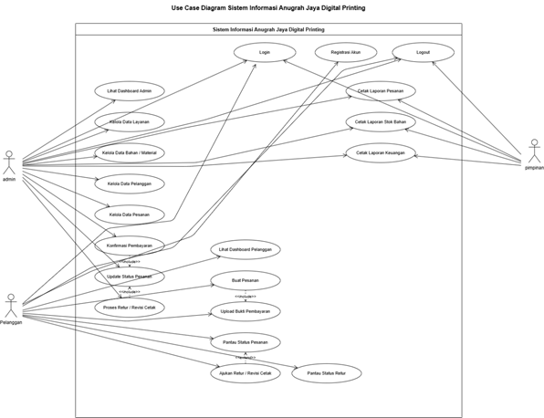
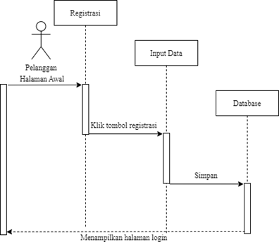

Karena ini untuk  **BAB IV Skripsi** , sequence diagram tidak hanya digambar, tetapi juga harus memiliki **teori (narasi pembahasan)** yang menjelaskan setiap alur pesan (message) antar objek. Berdasarkan video tersebut, berikut materi lengkap beserta **prompt AI** (untuk Draw.io AI, Mermaid AI, Lucidchart AI, Whimsical AI, atau ChatGPT) agar menghasilkan sequence diagram yang rapi.

---

# 4.X Sequence Diagram Login Pelanggan

## 4.X.1 Pengertian Sequence Diagram

Sequence Diagram merupakan salah satu diagram dalam Unified Modeling Language (UML) yang digunakan untuk menggambarkan interaksi antar objek dalam suatu sistem berdasarkan urutan waktu (sequence). Diagram ini menunjukkan bagaimana objek saling bertukar pesan (message) untuk menjalankan suatu proses tertentu hingga menghasilkan keluaran yang diinginkan.

Pada sistem informasi berbasis MVC (Model-View-Controller), Sequence Diagram digunakan untuk menggambarkan komunikasi antara pengguna, View, Controller, Model, dan Database selama proses login berlangsung. Dengan adanya Sequence Diagram, pengembang dapat memahami alur proses secara rinci mulai dari pengguna memasukkan data login hingga sistem memberikan respons berupa keberhasilan ataupun kegagalan autentikasi.

---

# 4.X.2 Aktor yang Terlibat

Terdapat lima objek utama yang terlibat dalam proses login, yaitu:

| No | Objek            | Keterangan                                                              |
| -- | ---------------- | ----------------------------------------------------------------------- |
| 1  | Pelanggan        | Pengguna yang melakukan login ke sistem.                                |
| 2  | View Login       | Halaman yang menampilkan form login kepada pengguna.                    |
| 3  | Login Controller | Controller yang menerima data login dan mengatur proses autentikasi.    |
| 4  | Login Model      | Model yang berkomunikasi dengan database untuk melakukan validasi akun. |
| 5  | Database         | Tempat penyimpanan data akun pelanggan.                                 |

---

# 4.X.3 Alur Sequence Diagram Login

Proses login berlangsung sebagai berikut.

### 1. Membuka Halaman Login

Pelanggan membuka halaman login sehingga sistem menampilkan form login melalui View Login.

---

### 2. Mengisi Form Login

Pelanggan memasukkan email dan password kemudian menekan tombol Login.

---

### 3. Mengirim Data ke Controller

View Login mengirimkan data email dan password menuju Login Controller.

---

### 4. Validasi Awal

Login Controller melakukan pengecekan apakah seluruh field telah diisi.

Apabila terdapat data kosong maka:

* Controller tidak mengakses database.
* Controller langsung mengirim pesan kembali ke View Login.
* View Login menampilkan notifikasi:

> "Email dan Password harus diisi."

Proses selesai.

---

### 5. Mengakses Model

Jika seluruh data telah lengkap maka Login Controller memanggil Login Model.

---

### 6. Pengecekan Database

Login Model mengirim query ke Database untuk mencari data berdasarkan email yang dimasukkan pengguna.

Database kemudian mengembalikan hasil pencarian kepada Login Model.

---

### 7. Validasi Password

Model melakukan pengecekan apakah password sesuai.

---

### 8. Kondisi Login Gagal

Jika email tidak ditemukan atau password salah maka:

* Login Model mengirim status gagal kepada Login Controller.
* Login Controller memanggil View Login.
* View Login menampilkan pesan:

> "Maaf, Email atau Password Anda salah."

Pengguna tetap berada pada halaman login.

---

### 9. Kondisi Login Berhasil

Jika email dan password sesuai maka:

* Login Model mengirim status berhasil.
* Login Controller membuat Session Login.
* Login Controller mengarahkan pengguna menuju halaman Dashboard/Home.

---

# 4.X.4 Narasi Sequence Diagram

Sequence Diagram login menggambarkan interaksi antara Pelanggan, View Login, Login Controller, Login Model, dan Database. Proses dimulai ketika pelanggan membuka halaman login dan memasukkan email serta password. Data tersebut dikirim ke Login Controller untuk dilakukan validasi awal. Apabila seluruh data telah lengkap, Controller meneruskan proses kepada Login Model yang bertugas melakukan pengecekan data pada Database.

Database mengembalikan hasil pencarian kepada Model. Jika data tidak sesuai, Controller memerintahkan View Login untuk menampilkan pesan kesalahan. Sebaliknya, apabila data valid, Controller membuat session login dan mengarahkan pelanggan menuju halaman utama sistem.

---

# Lifeline Sequence Diagram

```
Pelanggan
View Login
Login Controller
Login Model
Database
Dashboard
```

---

# Message Sequence

```
1. Buka Halaman Login()

2. Tampilkan Form Login()

3. Input Email & Password()

4. Klik Tombol Login()

5. Kirim Data Login()

6. Validasi Input()

alt Data Kosong

7. Tampilkan Pesan
"Email dan Password harus diisi"

else Data Lengkap

8. Validasi Login()

9. Cek Database()

10. Return Data User()

alt Login Gagal

11. Return False()

12. Tampilkan Pesan
"Email atau Password Salah"

else Login Berhasil

13. Return True()

14. Buat Session()

15. Redirect Dashboard()

16. Dashboard Ditampilkan()

end
```

---

# Prompt AI (Draw.io AI / Mermaid AI / Lucidchart AI)

Gunakan prompt berikut agar AI menghasilkan sequence diagram yang rapi.

```text
Buat Sequence Diagram UML untuk proses Login Pelanggan menggunakan arsitektur MVC.

Actor:
- Pelanggan

Objects:
- View Login
- Login Controller
- Login Model
- Database
- Dashboard

Alur:

1. Pelanggan membuka halaman Login.
2. View Login menampilkan Form Login.
3. Pelanggan mengisi Email dan Password.
4. Pelanggan menekan tombol Login.
5. View Login mengirim data ke Login Controller.
6. Login Controller melakukan validasi input.

ALT 1 (Data kosong)
- Login Controller mengirim kembali ke View Login.
- View Login menampilkan pesan "Email dan Password harus diisi."

ELSE

7. Login Controller memanggil Login Model.
8. Login Model mengirim query ke Database.
9. Database mengembalikan data pengguna.

ALT 2 (Email atau Password salah)
- Login Model mengembalikan status gagal.
- Login Controller memanggil View Login.
- View Login menampilkan pesan "Email atau Password salah."

ELSE

10. Login Model mengembalikan status berhasil.
11. Login Controller membuat Session Login.
12. Login Controller melakukan Redirect ke Dashboard.
13. Dashboard ditampilkan kepada Pelanggan.

Gunakan activation bar.
Gunakan combined fragment ALT untuk percabangan.
Gunakan return message (garis putus-putus).
Diagram harus rapi dengan lifeline vertikal dan urutan sesuai konsep MVC.
```

---


berikut usecase saya

Buatkan semua sequence diagram dri use case syaa ini

harus dengan icon ini


UML 2.5

👤 Actor

○ Boundary

○ Control

○ Entity

▭ Lifeline

▮ Activation

➜ Message

⇠ Return Message

Fragment

ini contoh pembuatan seqeunce diagram , jangan bewarna ingattt


